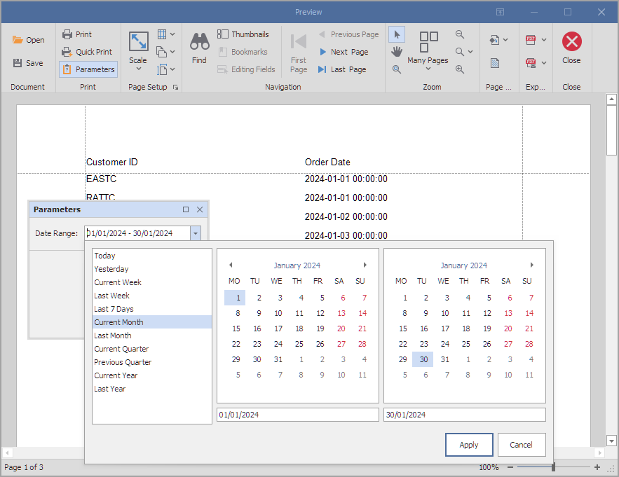

# Reporting for WinForms - Create a Date Range Report Parameter

This example shows how to create a date range report parameter and use that parameter to filter data in the report.

## Files to Review

* [Program.cs](./CS/Program.cs) (VB: [Program.vb](./VB/Program.vb))

## Documentation

* [Date Range Report Parameters](https://docs.devexpress.com/XtraReports/401380/detailed-guide-to-devexpress-reporting/use-report-parameters/date-range-report-parameters)

## More Examples

* [Reporting for WinForms - Add Parameters to Report at Runtime](https://github.com/DevExpress-Examples/reporting-winforms-add-report-parameters)
* [Reporting for WinForms - Implement a Custom Parameter Editor](https://github.com/DevExpress-Examples/reporting-winforms-implement-custom-parameter-editor)